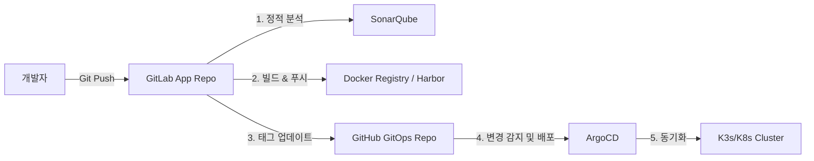

# 🚀 Acer Web Service GitOps Repository (`acer-argocd`)

이 저장소는 **ArgoCD**를 통해 Kubernetes(K8s/K3s) 클러스터에 애플리케이션을 자동으로 배포하기 위한 **GitOps 선언형 매니페스트 저장소**입니다.

GitLab의 CI 파이프라인에서 빌드가 성공하면, 자동화 봇이 이 저장소의 이미지 태그를 갱신하며, ArgoCD가 변경사항을 감지하여 클러스터에 실시간 동기화(Sync)합니다.

---

## 📂 디렉토리 구조

```text
acer-argocd/
├── k8s/                         # Kubernetes 리소스 정의 폴더
│   ├── namespace.yaml           # 배포 전용 네임스페이스 (web-service)
│   ├── fastapi-deployment.yaml  # Backend FastAPI 애플리케이션 정의
│   ├── fastapi-service.yaml     # FastAPI ClusterIP 서비스 정의
│   ├── nginx-configmap.yaml     # Nginx 리버스 프록시 설정 (가상 서버 설정)
│   ├── nginx-deployment.yaml    # Frontend Nginx 웹 서버 정의
│   ├── nginx-service.yaml       # Nginx NodePort 서비스 정의 (외부 노출용)
│   └── kustomization.yaml       # Kustomize 설정 및 이미지 태그 관리 파일 (자동 갱신 대상)
├── gitops/                      # ArgoCD 애플리케이션 정의 폴더
│   └── argocd/                  # ArgoCD 연결용 매니페스트
├── .gitignore                   # 불필요한 메타데이터 커밋 제외 설정
└── README.md                    # 본 가이드 문서
```

---

## 🔄 GitOps 배포 흐름 (Workflow)



1. **개발 평면 (GitLab)**: 개발자가 코드를 수정하여 GitLab `main` 브랜치에 푸시합니다.
2. **코드 검증 (SonarQube)**: 소나큐브 정적 분석 품질 게이트가 통과되면 빌드가 시작됩니다.
3. **이미지 빌드**: 도커 이미지를 빌드하여 레지스트리에 최신 커밋 SHA 태그로 업로드합니다.
4. **GitOps 트리거**: GitLab CI가 본 저장소(`acer-argocd`)의 `k8s/kustomization.yaml` 내 `newTag` 값을 신규 빌드 이미지 태그로 자동 수정하여 푸시합니다.
5. **자동 배포 (ArgoCD)**: ArgoCD가 본 저장소의 변경사항을 3분 주기로 감지(또는 즉시 Sync)하여 쿠버네티스 클러스터의 실제 상태를 최신화합니다.

---

## 🌐 서비스 접속 정보

쿠버네티스 클러스터 내에서 서비스는 다음과 같이 노출되도록 포트 포워딩 및 노드포트(NodePort)가 세팅되어 있습니다.

| 구성 요소 | 내부 포트 | 외부 노출 포트 (NodePort) | 접속 방법 |
| :--- | :---: | :---: | :--- |
| **Nginx (Frontend)** | `80` | `30080` | `http://<Node_IP>:30080` |
| **FastAPI (Backend)** | `8000` | *비노출 (ClusterIP)* | Nginx 리버스 프록시를 통해서만 내부 연동 |

---

## 🛠️ 유지보수 및 수동 적용 가이드

로컬에서 수동으로 본 저장소의 리소스를 클러스터에 배포해 보고 싶을 경우 아래 명령어를 사용합니다. (Kustomize 가 반드시 설치되어 있어야 합니다.)

```bash
# k8s 폴더 경로에서 실행
kubectl apply -k .
```
